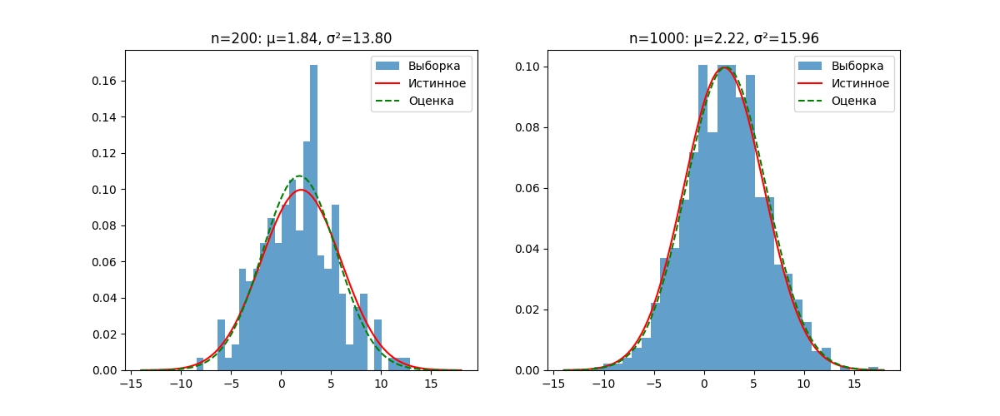

# Результаты выполнения задания 1

Метод моментов для нормального распределения с μ=2, σ=4.

## Оценки параметров

| Размер выборки | \hat{μ} | \hat{σ²} | Истинные μ | Истинные σ² |
|-----------------|----------|------------|-------------|--------------|
| 200             | 1.8369 | 13.7990 | 2        | 16      |
| 1000            | 2.2169 | 15.9575 | 2        | 16      |

## Сравнение с истинными значениями

| Размер выборки | Ошибка μ | Ошибка σ² |
|-----------------|-----------|------------|
| 200             | 0.1631    | 2.2010     |
| 1000            | 0.2169    | 0.0425     |

## Графики

