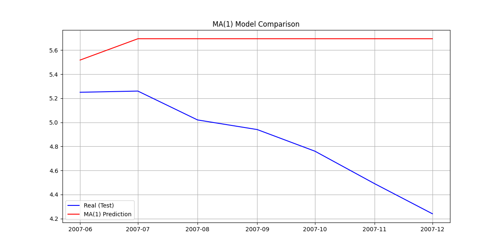
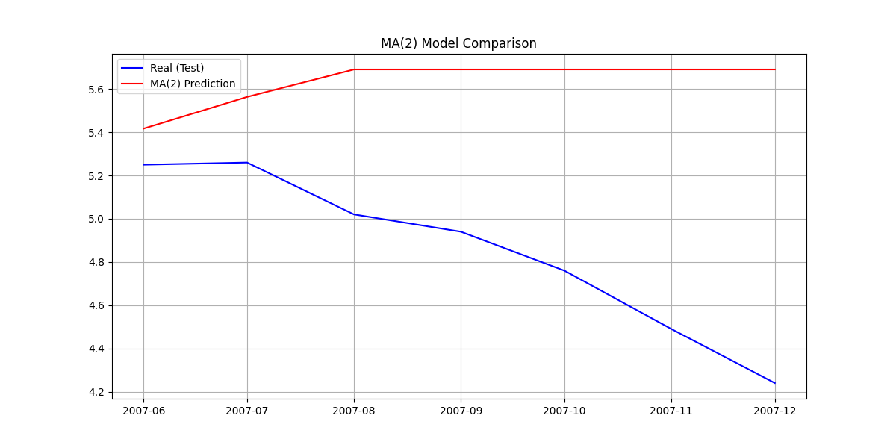
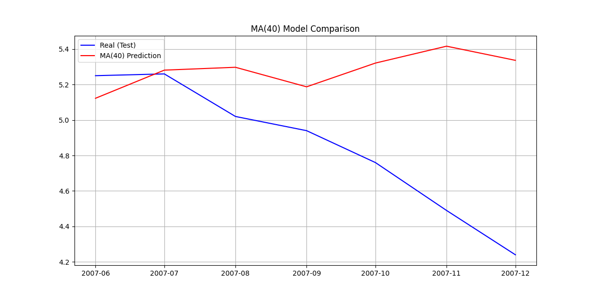
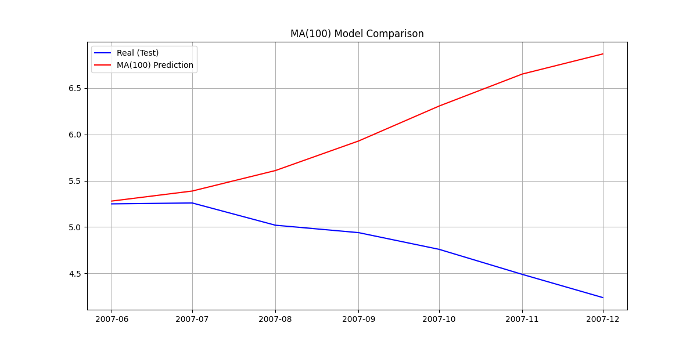

# Результаты моделирования MA-процессов

Данные ограничены периодом до 2008 года.
Разбиение на тренировочную и тестовую выборки по дате: до 2008 года

## Модель MA(1)

График прогнозных значений против реальных:

MSE: 0.8185

Модель MA(1) учитывает только одну предыдущую ошибку. График, вероятно, будет слабо повторять динамику, сглаживая ряд.

## Модель MA(2)

График прогнозных значений против реальных:

MSE: 0.7922

## Модель MA(4)

График прогнозных значений против реальных:

MSE: 0.7443

## Модель MA(40)

График прогнозных значений против реальных:

MSE: 0.3614

## Модель MA(100)

График прогнозных значений против реальных:

MSE: 2.1846

Модель MA(100) учитывает множество прошлых ошибок. Это может привести к переобучению или, наоборот, к лучшему улавливанию долгих зависимостей, но график может быть шумным или слишком инертным.

## Общие выводы

С увеличением порядка q модель получает больше информации о прошлых шоках (ошибках).
Ожидается, что при увеличении q качество подгонки может улучшаться до определенного момента, но слишком большое q может усложнить модель.
Визуально нужно оценить, насколько красная линия близка к синей.
