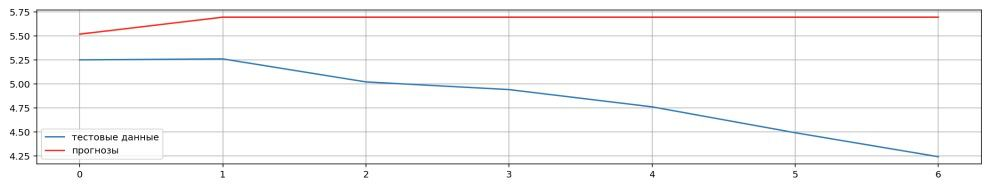

# 7.5 Практическая работа

## Цель практической работы

Научиться применять модель временных рядов — модель скользящего среднего.

---

## Что нужно сделать

В данной исследовательской задаче необходимо сравнить разные MA‑модели в зависимости от параметра q (количества предыдущих элементов временного ряда).

Для этого:

1. Импортируйте данные `FEDFUNDS.csv` до 2008 года.
2. Разбейте выборку так же, как показано в видео (на тренировочную и тестовую части).
3. Постройте MA(1).
4. Постройте MA(2).
5. Постройте MA(4).
6. Постройте MA(40).
7. Постройте MA(100).
8. Для каждой модели постройте график, визуализирующий реальные и прогнозные данные для тестовой выборки.
9. Сделайте выводы о построенных моделях.

Результатом будет построение пяти MA‑моделей.

---

## Советы и рекомендации

- Выполняйте все шаги в приведённой последовательности.
- Пользуйтесь материалами, показанными в видео.
- **Подсказка**: сравнивайте качество моделей по графику. Чем ближе красная кривая к голубой, тем лучше. Это означает, что модель всё точнее делает предсказания.

---

## Что оценивается

- Выполнены все девять шагов задания (1–9).
- Для каждой модели построен график качества — график реальных и прогнозных значений.
- Вывод о качестве моделей при увеличении q логичный и обоснованный.
